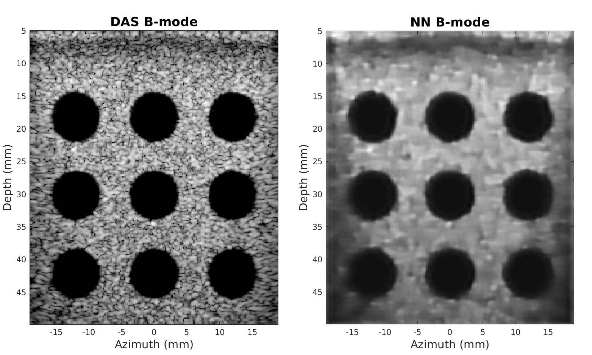
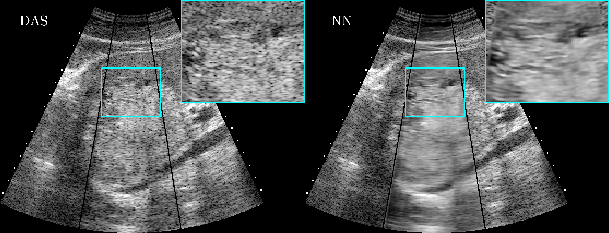

Threw this gitlab repo on github so I can use it and modify it asI want
# Ultrasound B-mode Imaging with Neural Networks



## Motivation
In pulse-echo ultrasound **B-mode** imaging, images are reconstructed according to the echogenicity of the medium (i.e., "Brightness"-mode). The standard way of reconstructing images with a transducer array is using **delay-and-sum** beamforming (DAS): time delays are applied to focus the signal at a point in space, and then the complex array signals are averaged together and the magnitude is displayed. DAS is robust and easy to compute, and is used ubiquitously in medical ultrasound imaging. However, most medical imaging targets (e.g., soft tissue) are composed of diffuse, unresolvable microscopic scatterers. Under DAS, the echoes from these scatterers combine stochastically to produce a strong multiplicative noise called **speckle**. Speckle results in a pattern with high variance, and is only representative of the underlying echogenicity when averaged over multiple speckles.

We [recently demonstrated](https://ieeexplore.ieee.org/abstract/document/8663450) that a simple fully convolutional neural network can be trained to estimate echogenicity using simulations of transducer array signals. The neural network produces ultrasound images with more accurate echogenicities than DAS, as quantified using normalization-independent log-scale versions of the mean absolute error (MAE), mean squared error (MSE), and multi-scale structural similarity (MS-SSIM) metrics.

## Description
This repository provides the code to train a B-mode network from scratch and includes code for the loss functions used in the paper. 

#### Datasets
The training and validation datasets are available [here](https://drive.google.com/drive/folders/1cNUsUhJs4KM_ujxl_Vs1Hl9vDJuUgS3K?usp=sharing) for download as MATLAB v7.3 .mat files, and should be placed in the `data/` folder.

The datasets consist of ground truth echogenicities obtained from the ImageNet and Places2 databases, along with matched Field II Pro ultrasound simulations of 128 elements of an L12-3v transducer downsampled into 16 subapertures. The training set is composed of 5000 image patches and the validation is composed of 128 image patches. Each image patch is 64x64 pixels. Each patch corresponded to a random physical extent (`xext`, `zext`) and position (`xctr`, `zctr`) in order to simulate a wide variety point spread functions.

The data shape should be 5-dimensional:
- MATLAB: \[Real/Imag, Channels, Depth, Azimuth, Patch Index\]
- Python: \[Patch Index, Azimuth, Depth, Channels, Real/Imag\]

A formatted test dataset from the PICMUS challenge is also available.

#### Training a B-mode neural network
The code has been tested for TensorFlow Keras version 1.14.0. To train a neural network from scratch, execute [src/train.py](src/train.py).

Training progress can be monitored via TensorBoard. Checkpoints are automatically written to the `runs/` directory. TensorBoard can be initialized using
```bash
tensorboard --logdir=runs/
```
and the results can be viewed in a browser at the url `localhost:6006`.

For reference, a neural network can be fully trained on a single NVIDIA GTX 1080Ti GPU in 5 to 10 minutes. A fully trained model is also provided in [runs/pretrained/model.h5](runs/pretrained/model.h5).

#### Evaluating the network on new data
To evaluate the neural network on test data, use [src/predict.py](src/predict.py). The `predict()` function takes an input .mat file, a `model.h5` file, and the desired output .mat file name as arguments. The [examples/makePICMUSImages.m](examples/makePICMUSImages.m) MATLAB script shows an example result after running `predict()` on the example PICMUS test dataset.

## Citing this work
This code is free to use and is provided under the [Apache License, Version 2.0](https://www.apache.org/licenses/LICENSE-2.0). We kindly ask that any publications resulting from this code cite the following reference:

D. Hyun, L. L. Brickson, K. T. Looby, and J. J. Dahl. "Beamforming and Speckle Reduction Using Neural Networks." *IEEE Transactions on Ultrasonics, Ferroelectrics, and Frequency Control*, *66*(**5**), pp. 898-910, 2019.
```
@ARTICLE{8663450, 
author={D. {Hyun} and L. L. {Brickson} and K. T. {Looby} and J. J. {Dahl}}, 
journal={IEEE Transactions on Ultrasonics, Ferroelectrics, and Frequency Control}, 
title={Beamforming and Speckle Reduction Using Neural Networks}, 
year={2019}, 
volume={66}, 
number={5}, 
pages={898-910}, 
doi={10.1109/TUFFC.2019.2903795}, 
ISSN={0885-3010}, 
month={May},}
